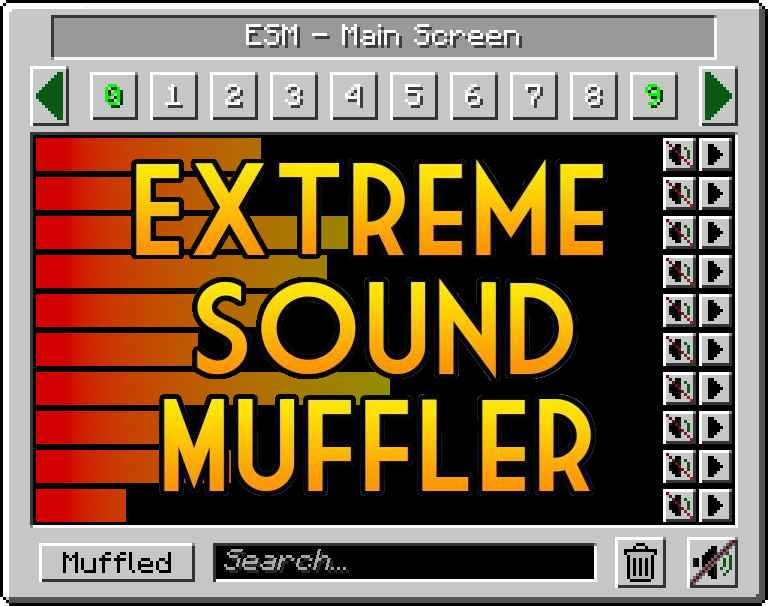

<!--  -->
<h1 align="center"> Extreme sound muffler Minecraft mod</h1>
 

---
<h3 align="center"> Extreme sound muffler is a client side mod that allows you to muffle sounds selectively. </h3> 
 

 <b> 🔥 Curseforge:   </b> 

 <b> Forge: </b> 

  

 <b> Fabric: </b> 

  

 <b> 🔧 Modrinth:   </b> 

  

 <b> Github: </b> 

  
    

  
  <h5 align="center"><b>This Mod works on <a href= https://files.minecraftforge.net/net/minecraftforge/forge alt="FORGE"> FORGE</a> and <a href= https://fabricmc.net/use/installer/ alt="FABRIC"> FABRIC</a>.</b></h5>

<h6 align="center"><b>Now with Dark mode!! check the configs to enable it!</b></h6>

## HOW IT WORKS:

    1. Click on the button in your inventory or assign a key to open the gui.

    2. Click on the button next to the sound you want to muffle.

    3.  Optional: set the volume of the sound dragging the slider around.

    4. Optional: press the play button to be sure that's the sound you want to muffle.

    5. Enjoy peace.

## What about Anchors?
#### Anchors are ranged mufflers, for when you want to muffle a sound on a small area.

    1. Open your ESM Screen

    2. Select one of the 10 numbered buttons

    3. Press the marker like button on the right panel to set the Anchor position

    4. Optional: press the edit Anchor button (next to marker) and set the name and range of the Anchor

    5. Muffle the sounds and enjoy ranged peace

#### You can change the Anchor position whenever you want by pressing the marker button.

## Inventory button

#### if you don't like the ESM muffler in the inventory, you can disable it in the config. 
#### if you don't like the position of the button, you can hold right mouse button over the muffler button and drag it wherever you want.

## Most things are configurable! like:

 - You can put the muffle and play buttons on the left right of the screen for easier visuals.
 - You can disable the anchors.
 - You can blacklist sounds to prevent them from appearing in the ESM screen.
 - You can choose the default muffle volume.
 - You can disable the Inventory button

<a href= https://github.com/LeoBeliik/ExtremeSoundMuffler/blob/master/Default_Config_At_3.15%2BForge.toml> Forge Config file</a>
 
<a href= https://github.com/LeoBeliik/ExtremeSoundMuffler/blob/master/Default_Config_At_3.20%2BFabric.json5> Fabric Config file</a>
 
 

 Thanks to <b>JetBrains</b> and their <a href=(https://www.jetbrains.com/community/opensource/#support/)> Open Source Support </a>

